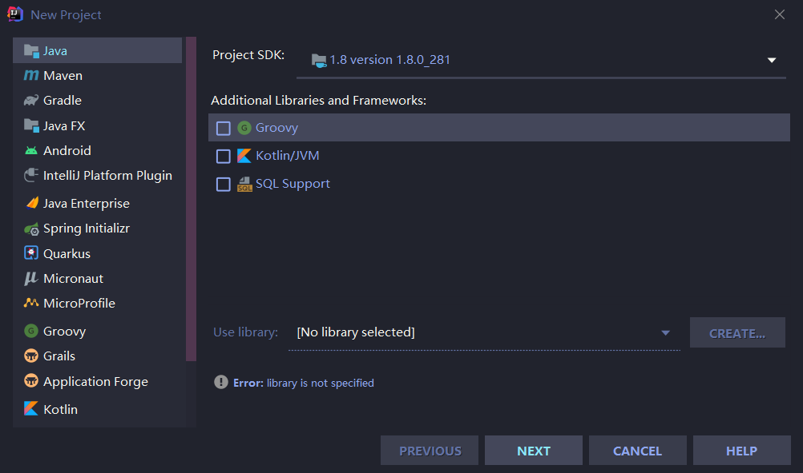
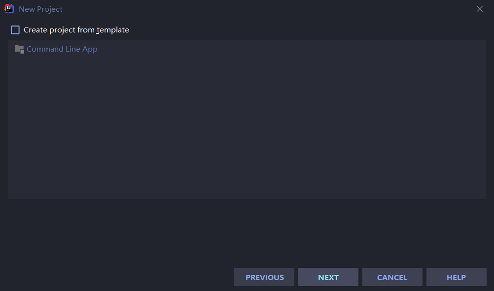
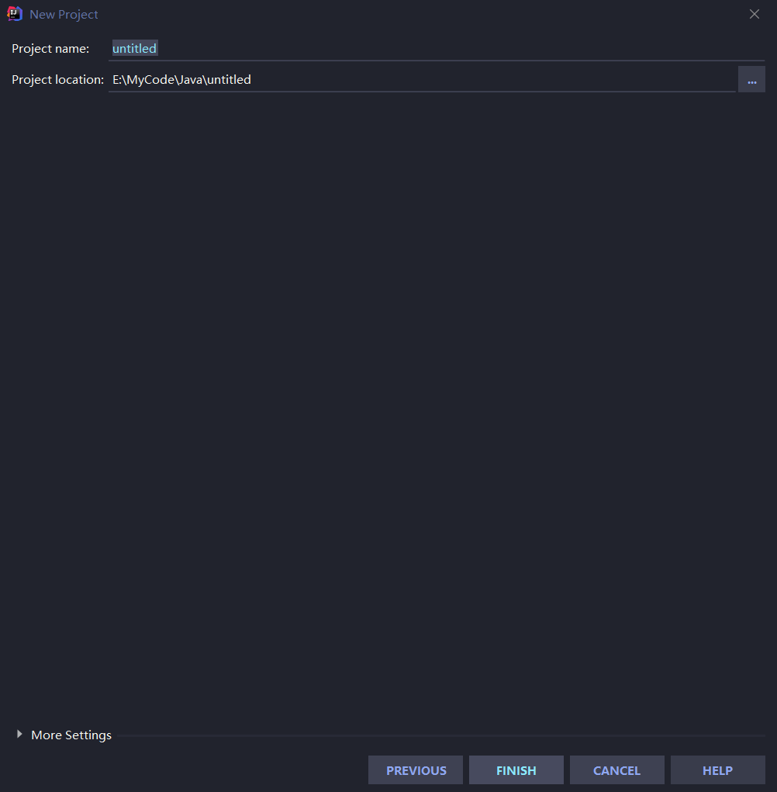
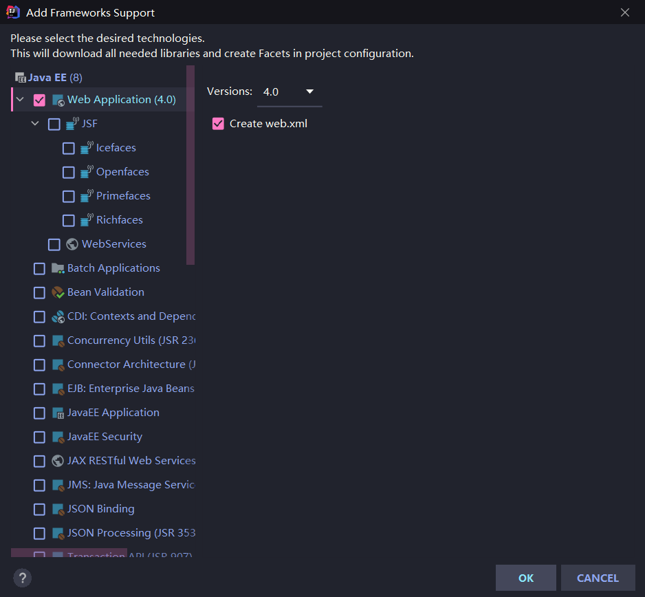
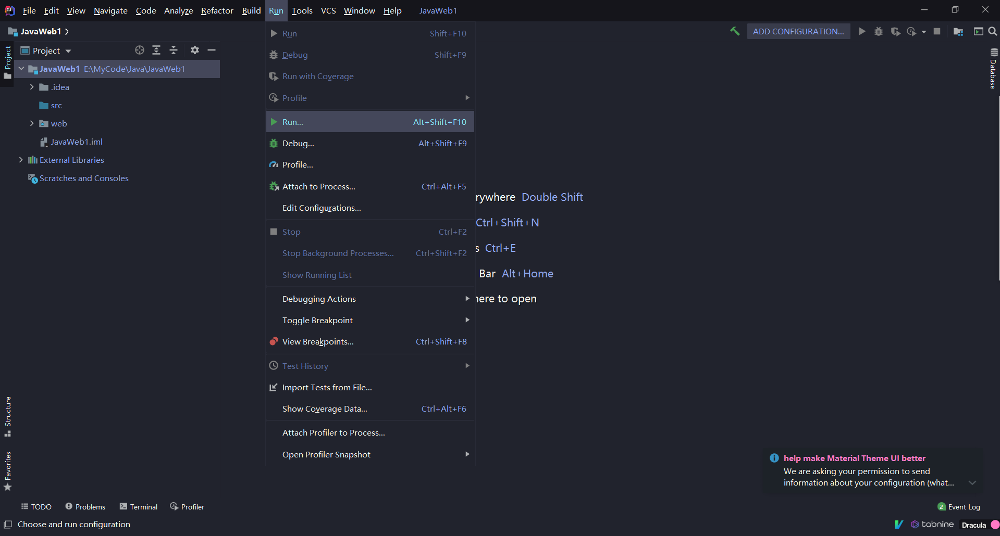
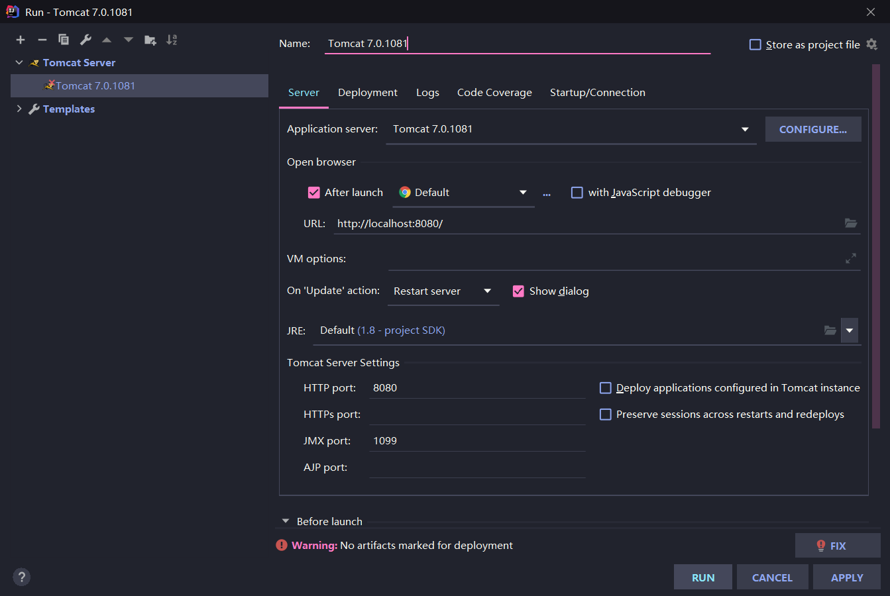
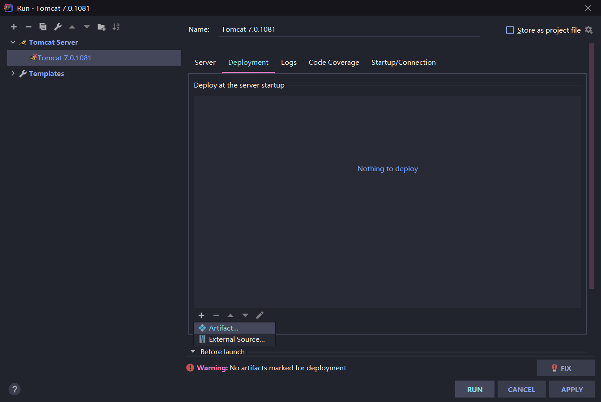
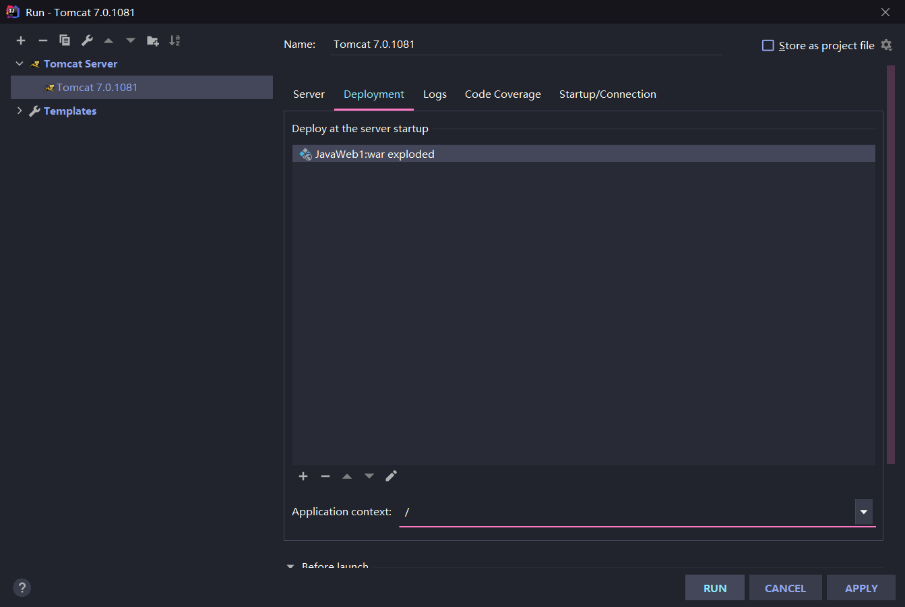

# IDEA-2020.3 新建 JavaWeb
## IDEA-2020.3 首先建立 Java 项目
1. 点击 Java

2. 直接点击 next
![直接点击next]

3. 修改路径

## 建立 web 项目
4. 选中项目点击右键选择 add framework support

5. 选中Web application->OK

6. 点击run，在跳出的视窗里点击 add configuration

7. 点击+，选择tomcat server->local，点击configure添加tomcat目录

8. 选中deployment，点击+，点击artifact

9. 将application context改为/

10. run

## 创建 servlet
1. WEB-INF目录下添加classes和lib
