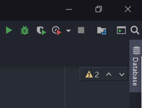
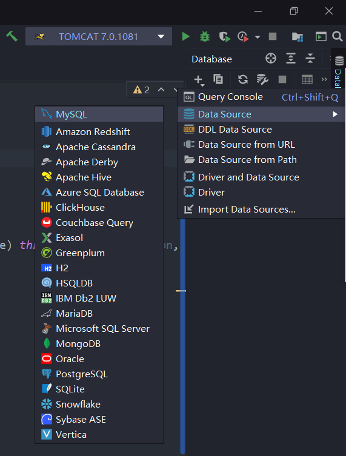
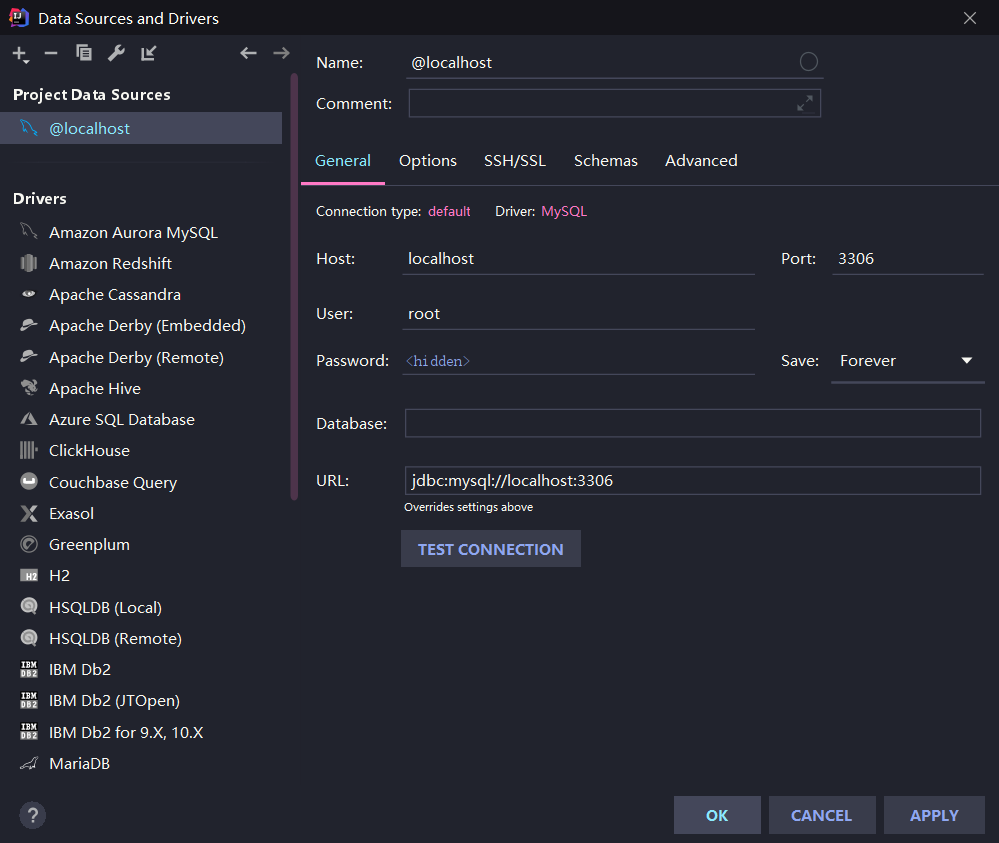
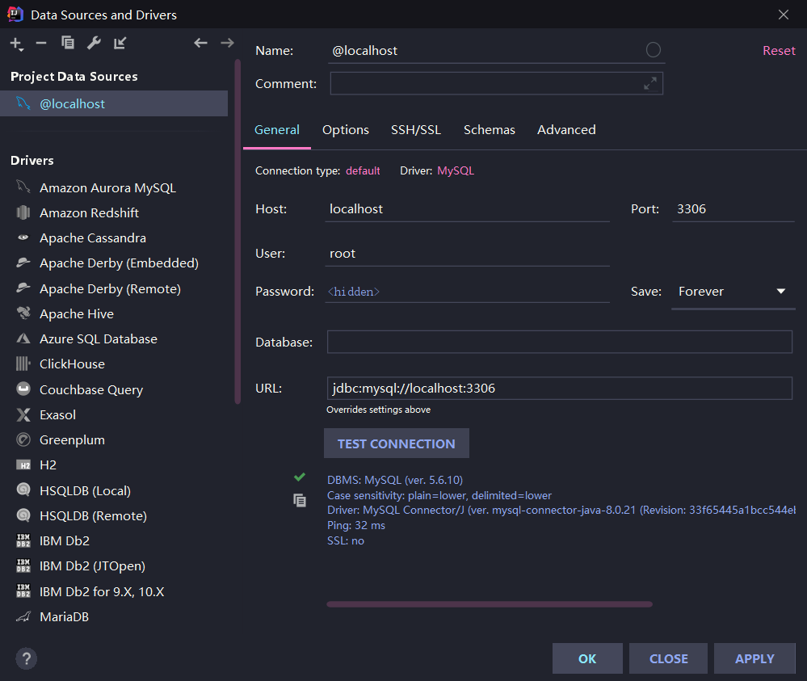
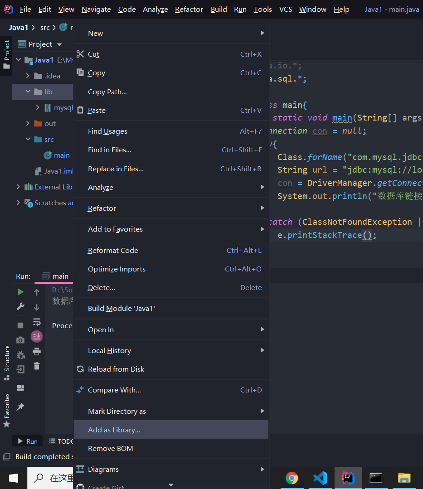
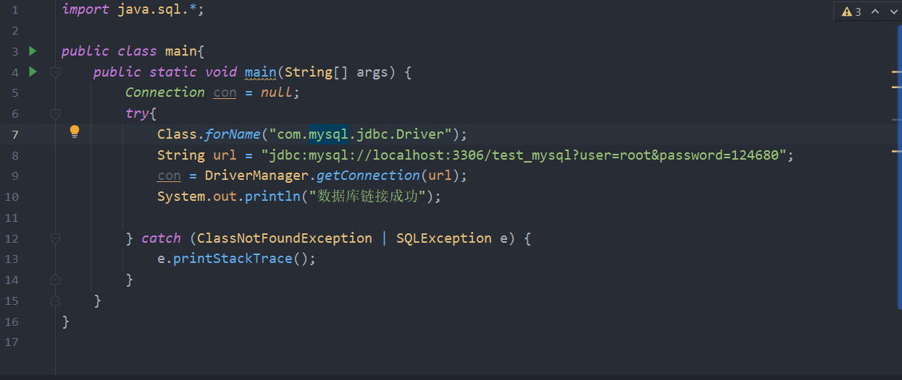

# IDEA 连接 MySQL
## win10
### IDE 直接连接
1. 打开一个 Web 项目，点击 IDEA 右上位置 Database

2. 点击 + ，选择Data Source，点击 MySQL

3. 填写 Name、Host、Port、User、Password，点击 Test CONNECTION

- 连接问题
    Server returns invalid timezone. Need to set 'serverTimezone' property. 
    点击 Advanced，找到 serverTimezone，输入GMT
    
    

### jdbc 连接
1. 新建 Java 项目，项目右键添加 lib 文件夹，将 mysql-connector-java 驱动放入文件夹

2. 右键 lib，选择 Add as libary

3. 测试

- mysql-connector-java 下载地址 https://dev.mysql.com/downloads/connector/j/