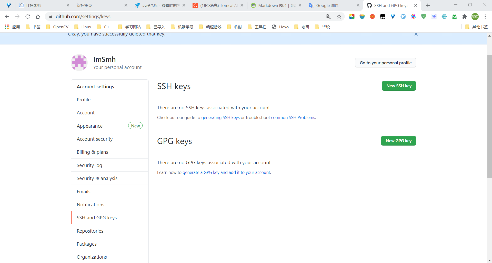

# Git & Github
1 创建 SSH Key  
`ssh-keygen -t rsa -C "(your email)@gmail.com"`  
2 期间遇到修改路径和添加密码，直接默认回车即可，完成之后可以在用户主目录下看到 .ssh 文件夹，复制 id_rsa.pub 文件的内容  
3 将复制的内容添加到 Github，点击 setting  
  
4 点击 SSH and GPG keys  

5 点击 SSH Keys 后的 new SSH key 按钮，将内容粘贴至 key 处