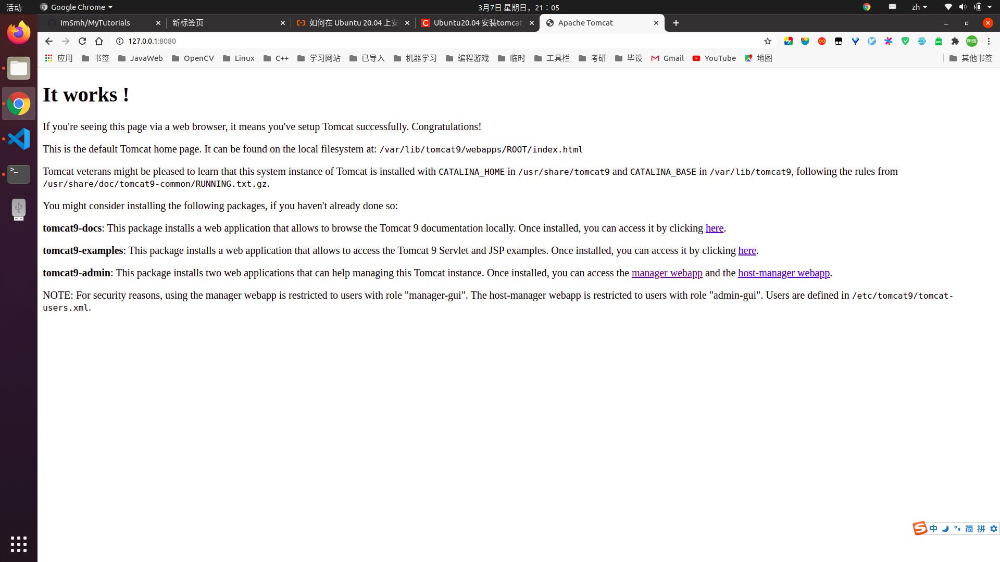

# Ubuntu-20 安装 tomcat-9
1. 安装 tomcat
```shell
sudo apt update
sudo apt-cache install tomcat
sudo apt install tomcat9 tomcat9-admin
```
2. 查看 8080 端口是否开启
```shell
ss -ltn
```
3. 防火墙开启 tomcat 端口
```shell
sudo ufw allow from any to any port 8080 proto tcp
```
4. 测试 tomcat 服务器

5. 创建网站管理用户
```shell
sudo vim /etc/tomcat9/tomcat-users.xml
```
添加以下内容
```
role rolename="admin-gui"/>
<user username="tomcat" password="tomcat" roles="admin-gui"/>
```
6. md，写个教程的功夫。。。。